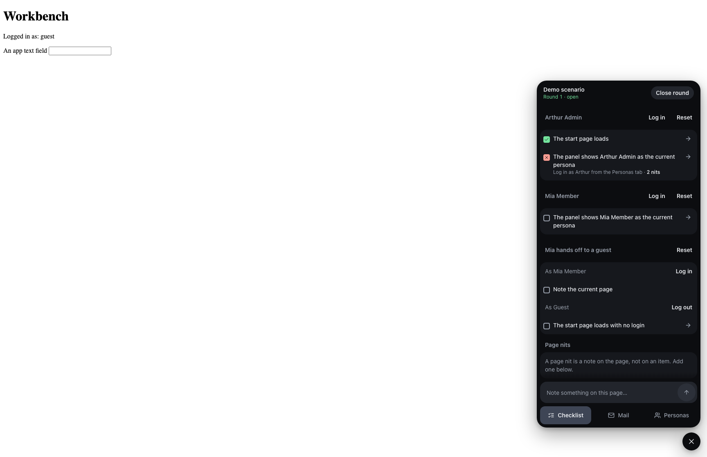

# Nitpick

[](https://packagist.org/packages/markhamsq/nitpick)
[](https://github.com/markhamsquareventures/nitpick/actions?query=workflow%3Arun-tests+branch%3Amain)
[](https://github.com/markhamsquareventures/nitpick/actions?query=workflow%3A"Fix+PHP+code+style+issues"+branch%3Amain)
[](https://packagist.org/packages/markhamsq/nitpick)

Nitpick is a tool for manual QA of a Laravel app on your local machine. You write a scenario as one
PHP class: the personas, the test data, and a checklist of things to check by hand. The package puts
a panel into each page of the app. In the panel, you reset the database to the scenario, log in as a
persona with one click, mark each check as pass or fail, write nits, and read the mail that the app
sent. When you close a round, the package writes the results to a Markdown file. An agent can read
the results with `php artisan nitpick:results --json` and write the retest for the next round.



## Requirements

- PHP 8.4 or later
- Laravel 13

## Security

The package can reset the database and log in as any user. For this reason, it works only on a
local machine:

- The package registers its routes, its panel, and its event listeners only when `APP_ENV=local`.
  In every other environment, the routes do not exist and each request to them gets a 404.
- In the local environment, each route and the panel also check the request host. A request to a
  host other than the `APP_URL` host gets a 404.
- The Artisan commands (`nitpick:install`, `nitpick:scenarios`, `nitpick:results`, `make:nitpick-scenario`) are always
  registered. They only read and write the package's own data and files.

Install the package as a dev dependency, so that it is not in a production build. To report a
security problem, see [SECURITY.md](SECURITY.md).

## Installation

```bash
composer require markhamsq/nitpick --dev
```

The package keeps its data in its own SQLite file, `storage/nitpick/nitpick.sqlite`, on a `nitpick`
connection. The package does not publish its migrations, so `php artisan migrate:fresh` in the app
does not touch this data. The package makes the file and runs its migrations the first time it needs
them. To do this on demand (safe to run again):

```bash
php artisan nitpick:install
```

To keep the file somewhere else, define a `nitpick` connection in the app's `config/database.php`.
The package then uses that definition.

To publish the config file:

```bash
php artisan vendor:publish --tag="nitpick-config"
```

The published config file contains:

```php
use MarkhamSq\Nitpick\Exporters\MarkdownExporter;

return [

    // Artisan parses this string like a shell and drops a single backslash. For a seeder class,
    // escape it: 'migrate:fresh --seeder='.addslashes(SomeSeeder::class).
    'reset_command' => 'migrate:fresh --seed',

    // The path that the panel opens after a login. A persona's 'home' in personas() overrides it.
    'home' => '/',

    'scenarios' => [
        'path' => base_path('tests/Scenarios'),
        'namespace' => 'Tests\\Scenarios',
    ],

    // Each class implements MarkhamSq\Nitpick\Exporters\RoundExporter and runs when a round closes.
    'exporters' => [
        MarkdownExporter::class,
    ],

];
```

## Write a scenario

```bash
php artisan make:nitpick-scenario AcmeCorpHeldInvitations
```

This command writes a stub to `tests/Scenarios`. Fill in the three methods:

```php
use MarkhamSq\Nitpick\Checklist;
use MarkhamSq\Nitpick\Handoff;
use MarkhamSq\Nitpick\Scenario;
use MarkhamSq\Nitpick\Section;

class AcmeCorpHeldInvitations extends Scenario
{
    public function setUp(): void
    {
        // Seeders and factories that make the state this scenario needs.
    }

    public function personas(): array
    {
        return [
            'arthur' => ['label' => 'Arthur Admin', 'email' => 'admin@acmecorp.test', 'home' => '/teams/acme-corp/members'],
        ];
    }

    public function checklist(Checklist $checklist): Checklist
    {
        return $checklist
            ->as('arthur', fn (Section $section) => $section
                ->check('Acme Corp is listed and there is no invitation alert', url: '/home')
                ->check('Per-row Send on Ursula: toast "Invitation sent."', url: '/teams/acme-corp/members', setup: 'Ursula is Not sent'))
            ->handoff('Invited admin registers', fn (Handoff $handoff) => $handoff
                ->step('arthur', 'Add member with a fresh address')
                ->switchTo('guest')
                ->step('guest', 'Open the invitation link from the mail pane'));
    }
}
```

A reset in the panel runs `reset_command`, then `setUp()`, then logs in as the persona. `setUp()`
must make a user for each persona. `guest` is a persona that is not logged in.

After a login or a reset, the panel opens the persona's `home`. A persona with no `home`, the
`guest` persona, and a login by email open the `home` path in the config (default `/`). A `home`
is a path on the app, for example `/dashboard`. `nitpick:scenarios` rejects a full URL.

To check the scenarios for duplicate keys and personas that are not declared:

```bash
php artisan nitpick:scenarios --json
```

The same scenario can set up a Pest test:

```php
use function MarkhamSq\Nitpick\scenario;
use function Pest\Laravel\actingAs;

it('lets Arthur open the members page', function () {
    $personas = scenario(AcmeCorpHeldInvitations::class);

    actingAs($personas['arthur'])->get('/teams/acme-corp/members')->assertOk();
});
```

## The panel

When `APP_ENV=local` and the request host is the host of `APP_URL`, the package puts the QA panel
into each full HTML page of the app. The app needs no setup step. A pill in the bottom-right corner
shows the current persona. It opens a card with three tabs:

- **Checklist**: the checks of the scenario, the reset and login buttons, and the nits.
- **Mail**: the mail that the app sent, with its links. A button runs the queue.
- **Personas**: find a user and log in as that user.

The keyboard shortcut **Alt+Shift+Q** (**Option+Shift+Q** on macOS) opens and closes the card. The
shortcut does nothing while the focus is in a text field of the app. **Escape** closes the card
when the focus is in the panel.

## Rounds

The Checklist tab starts and closes rounds. At most one round is open in the app. Round n shows
the scenario's checklist and the groups of `->retest(n)`. A round stays open through a reset. When
it closes, the package records the git SHA and a dirty flag of the app repo (a change in `docs/qa`
does not count), then writes `docs/qa/{scenario-slug}/round-{n}.md`. The dates are in
`app.timezone`. The tester is `git config user.name` in the app directory.

To read the results of a round (the JSON shape is in `src/Commands/ResultsCommand.php`):

```bash
php artisan nitpick:results {scenario-slug} --round=latest --json
```

A round keeps the scenario slug, so a renamed scenario class does not show its old rounds. To add
another exporter, add a class that implements `RoundExporter` to the `exporters` config list.

## The Boost skill

The package ships a [Laravel Boost](https://github.com/laravel/boost) skill at
`resources/boost/skills/nitpick-scenarios/`. `php artisan boost:update` in the app offers it. It tells an
agent how to write a scenario from a diff, read `nitpick:results --json`, and add a `->retest()` block for
the failures and nits of the last round.

## Development

```bash
composer install
npm ci
npx playwright install chromium
composer test
```

The browser test needs Playwright's Chromium. `npx playwright install chromium` installs it.

To see the panel in the package workbench:

```bash
vendor/bin/testbench serve --port=8765
```

Then open http://127.0.0.1:8765.

The built panel script is committed in `dist/`. After a change in `resources/js/`, build it again
and commit `dist/`. CI fails when `dist/` is not the build output.

```bash
npm run build
```

## Changelog

See [CHANGELOG](CHANGELOG.md) for the recent changes.

## Contributing

See [CONTRIBUTING](CONTRIBUTING.md).

## Security Vulnerabilities

See [SECURITY.md](SECURITY.md) for how to report a security vulnerability.

## Credits

- [Nick Basile](https://github.com/nickbasile)
- [All Contributors](../../contributors)

## License

The MIT License (MIT). See [License File](LICENSE.md) for more information.
